## 感恩节活动

时光服的感恩节坑，就是最后 280 烹饪等级制作的慢烤火鸡做不了了，因为火鸡不掉落了！
各大主城找平民接到感恩节任务

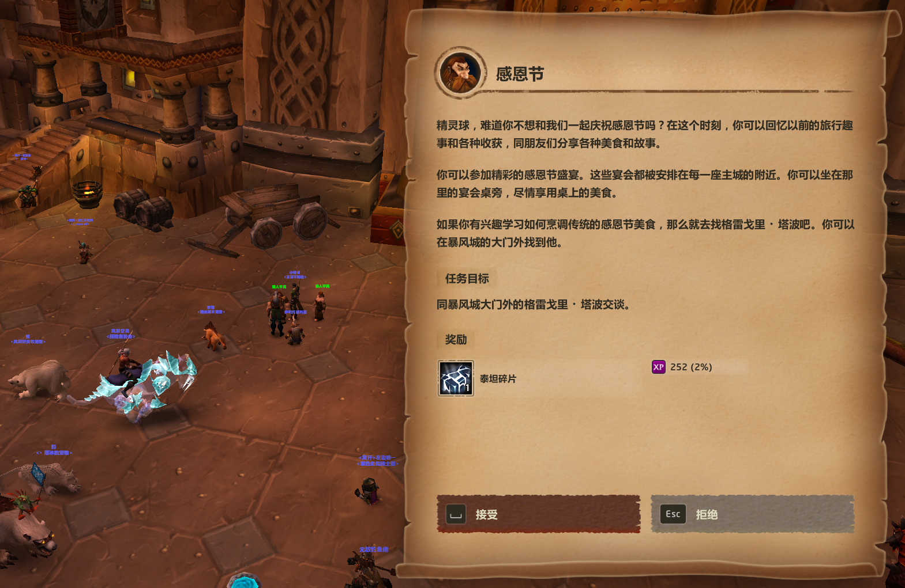
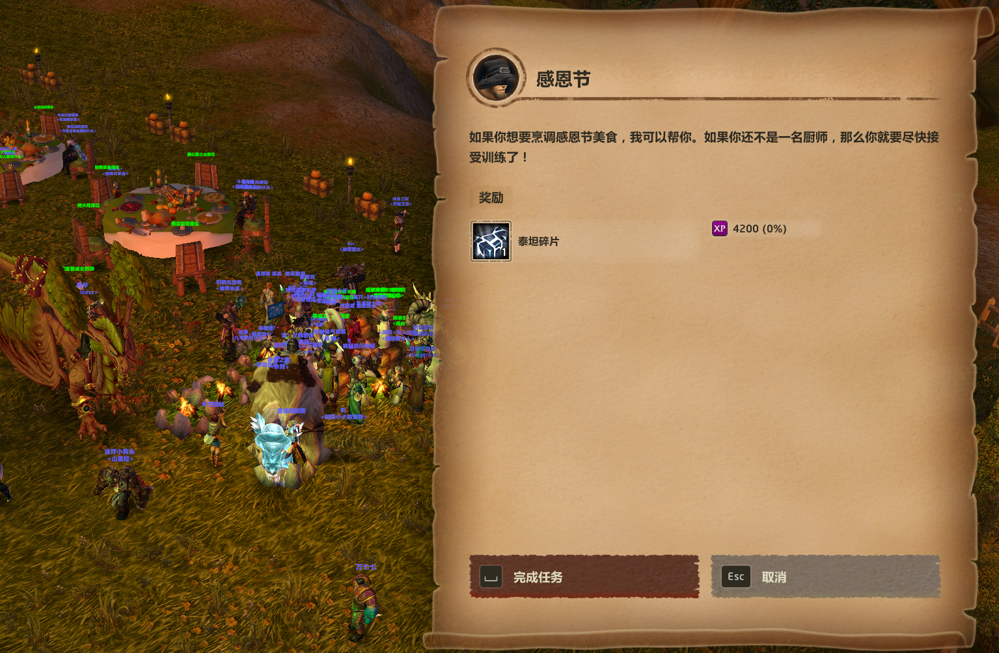

## 烹饪

| 序号 | 需要烹饪等级 | 食谱名称 | 需要食材 |
| --- | --- | --- | --- |
| 1 | 玉米馅料 | 0 | 香草面包、秋季香草 |
| 2 | 南瓜馅饼 | 100 | 蜂蜜、熟透的艾尔文南瓜（暴风城） |
| 3 | 酸果蔓酱 | 160 | 蜂蜜、辛香的湿地酸果蔓（铁炉堡） |
| 4 | 糖心甜土豆 | 220 | 蜂蜜、秋季香草、泰达希尔甜土豆（达纳苏斯） |
| 5 | 慢烤火鸡 | 280 | 蜂蜜、秋季香草、野生火鸡（需要一定的烹饪等级才有拾取） |

冲烹饪等级，可以考虑做糖心甜土豆到295才做慢烤火鸡，因为野生火鸡比较难获取

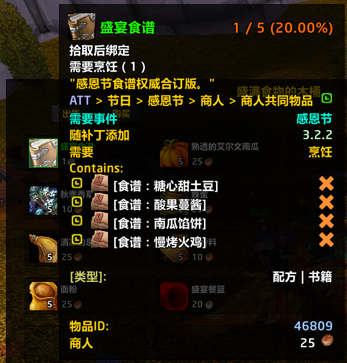
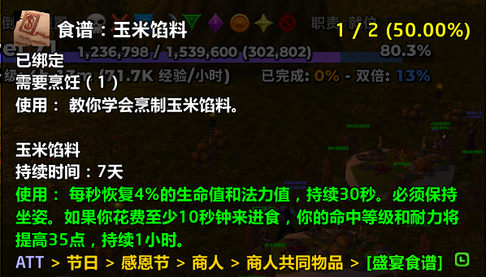
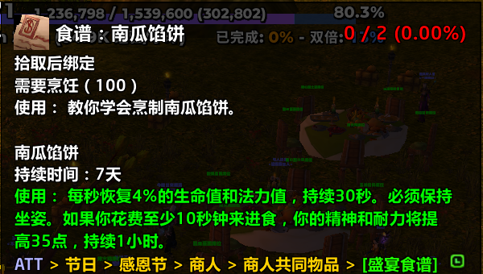
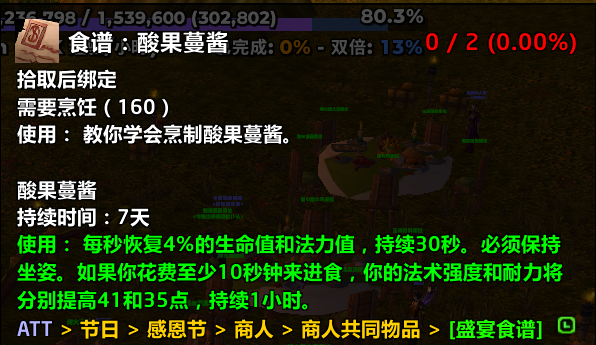
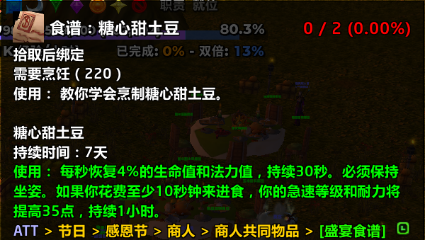
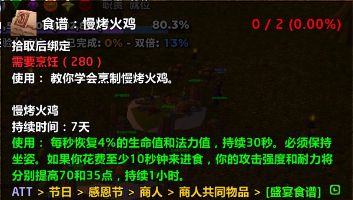

### 任务

| 序号 | 任务(前置任务序号) | 任务目标 | 接任务地点 | 交任务地点 |
| --- | --- | --- | --- |--- |
| 1 | 玉米馅料 | 玉米馅料 x 5 | 暴风城 | 暴风城 |
| 2 | 她喜欢土豆 | 糖心甜土豆 x 20 | 暴风城 | 暴风城 |
| 3 | 酸果蔓酱又吃完了 | 酸果蔓酱 x 20 | 暴风城 | 暴风城 |
| 4 | 南瓜馅饼(1) | 南瓜馅饼 x 5 | 暴风城 | 铁炉堡 |
| 5 | 火鸡还是缺 | 慢烤火鸡 x 20 | 铁炉堡 | 铁炉堡 |
| 6 | 别忘了那馅料 | 玉米馅料 x 20 | 铁炉堡 | 铁炉堡 |
| 7 | 小菜一碟 | 南瓜馅饼 x 20 | 达纳苏斯 | 达纳苏斯 |

> 去暴风城，如果需要冲烹饪等级，做 “玉米馅料”，一直冲到100
> 去暴风城，完成【1.玉米馅料】任务，接其他任务，并买至少 20 个南瓜，如果需要冲烹饪等级，需要买更多，一直冲到160
> 去铁炉堡，完成【4.南瓜馅饼】【6.别忘了那馅料】任务，接其他任务，并做 “酸果蔓酱”，完成【3.酸果蔓酱又吃完了】，并且至少买 20 个 “辛香的湿地酸果蔓”，如果需要冲烹饪等级，需要买更多，一直冲到220
> 去达纳苏斯，接取任务，完成【2.她喜欢土豆】【7.小菜一碟】，至少买 20 个 “泰达希尔甜土豆”，如果需要冲烹饪等级，需要买更多，一直冲到280，可以直接冲到295
> 回暴风城交任务，并击杀足够多的火鸡，60个吧
> 回铁炉堡交任务
> 不做成就就不用去埃索达

1. 全程找法师传送
2. 炉石绑暴风城，坐地铁到铁炉堡
3. 坐地铁回暴风城，坐船去黑海岸，飞行点到泰达希尔
3. 飞行点到黑海岸，坐船去埃索达
4. 坐船到黑海岸，坐船到暴风城

### 火鸡宏

```
/tar 野生火鸡
/cast [@野生火鸡, harm, nodead][] 冰枪术
```
### 地点

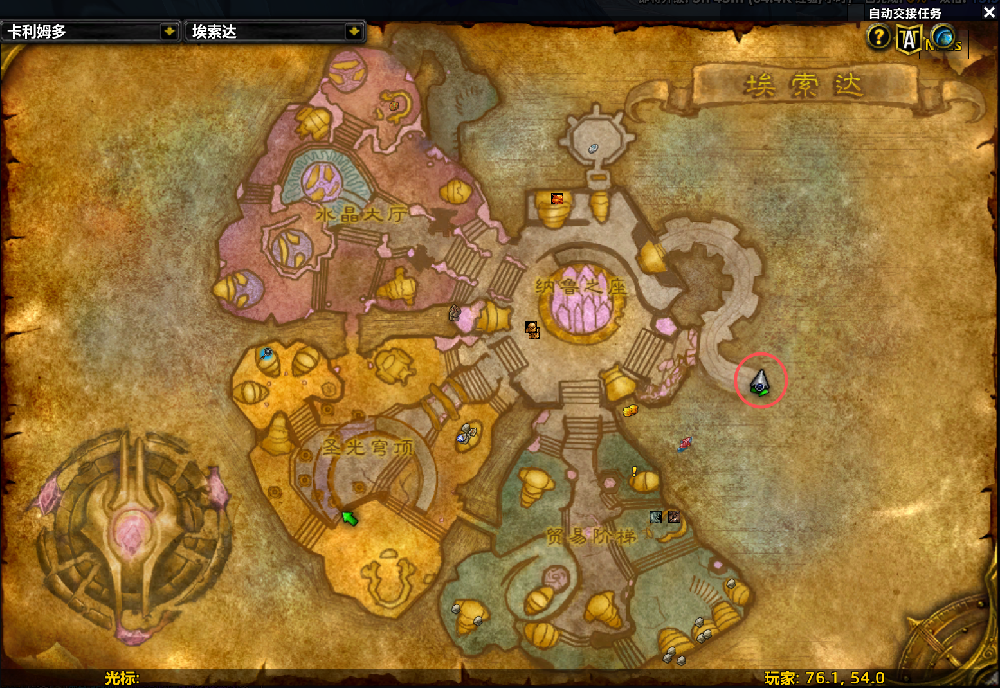

### 暴风城


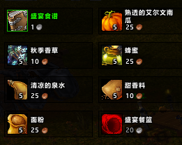

### 铁炉堡

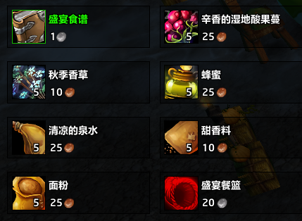
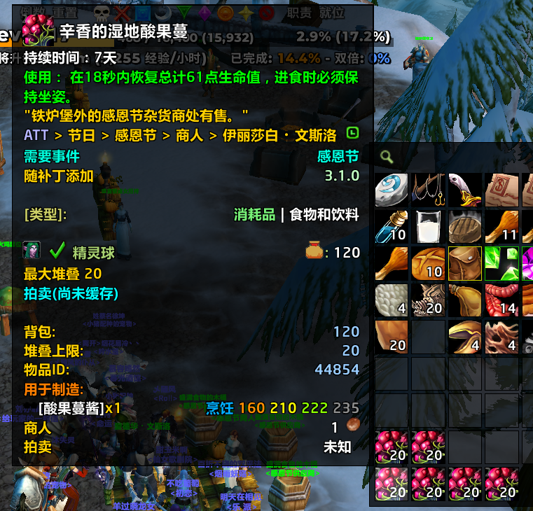
